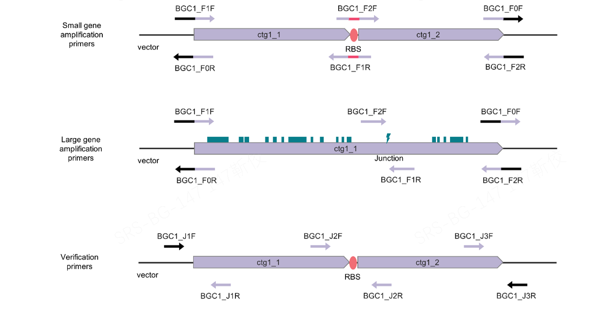

# PARBIG
PARBiG(www.parbig.com) is a primer design tool for the cloning and reconstruction of large, complex gene clusters. No programming background is required for users, who can acquire primer design results by uploading the relevant files.

